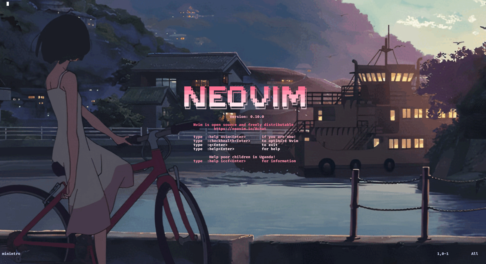

# minintro.nvim
Extremely minimalistic intro screen for Neovim. This fork of [eoh-bse's minintro](https://github.com/eoh-bse/minintro.nvim/) allows for a multi-colored title screen.

## Motivation
`minintro.nvim` hijacks the `no-name` buffer and draws a simple intro logo.
If you just want a simple and lightweight startup intro that works, this plugin is for you.

## Screenshot


## Installation
```lua
-- Lazy
{
    "SRCthird/minintro.nvim",
    config = true,
    lazy = false
}
```

```lua
-- Packer
use {
    "SRCthird/minintro.nvim",
    config = {function() 
        require("minintro").setup() 
    end}
}
```

## Configuration
There is only a few option available for `minintro.nvim` and all of which are optional. `colors` is the array of colors for the intro logo. 
`title`, `version` and `info` are all string arrays that replace their respective sections of the screen. There is no need
to create a separate config file. Pass the config directly in your plugin installation file. You can choose as many colors as you'd like.
```lua
-- Lazy
{
    "SRCthird/minintro.nvim",
    opts = { 
        title = { "   Neovim   "},
        colors = { "#98c379" }
    }
    config = true,
    lazy = false
}
```

```lua
-- Packer
use {
    "SRCthird/minintro.nvim",
    config = {function()
        require("minintro").setup({ 
            version = { 
                "",
                "v0.10.0",
                ""
            },
            colors = { "#f72585", "#b5179e", "#560bad"  }
        }) 
    end}
}
```

## Reference Configuration
If you want to see a neovim configuration using this plugin, please refer to [this
nvim setup](https://github.com/SRCthird/nvim)
